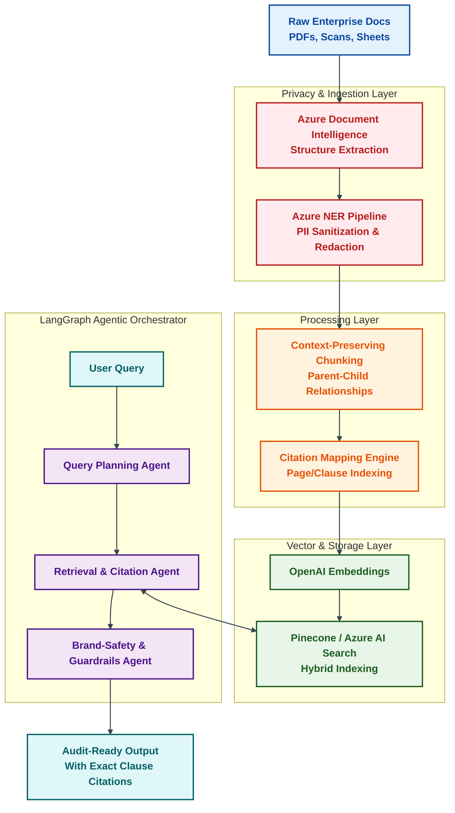

# Catchy LinkedIn Post: Enterprise Agentic RAG & Citation Engine

Here is a highly engaging, technically rigorous LinkedIn post tailored to your experience as an AI Solution Architect and Principal Software Engineer. It features a complete architecture overview, a Mermaid diagram illustrating the data and query flow, and clean code snippets/design patterns.

---

### **LinkedIn Post Draft**

**Title:** Beyond Chatbots: Architectural Patterns for Audit-Ready Enterprise Agentic RAG 🚀

Move over basic wrapper APIs. Building a proof-of-concept RAG app takes an afternoon. Moving it to production for enterprise auditing or financial compliance? That takes an entirely different level of engineering rigor.

When dealing with high-volume, sensitive financial documents, you face three major production bottlenecks:
1. **The PII Compliance Wall:** You cannot feed raw, unredacted corporate data to public APIs.
2. **Context Fragmentation:** Naive chunking breaks semantic relationships (e.g., splitting a tax table or a clause midway).
3. **The "Trust Gap":** If your LLM cannot prove *exactly* where it got its numbers (down to the page, clause, and paragraph), auditors will never trust it.

To solve this, we designed and implemented a production-ready, zero-trust **Agentic RAG Pipeline** with multi-agent orchestration and precision citation mapping.

Here is the architectural blueprint we used:



---

### **How We Solved the Production Challenges:**

#### **1. The Zero-Trust Privacy Layer**
Before any document hits our embeddings pipeline, it passes through **Azure Document Intelligence** to extract the layout and semantic structure. Then, a custom **FastAPI + Named Entity Recognition (NER)** microservice scrubs PII, acronyms, and corporate identifiers, replacing them with compliance-safe tokens.

#### **2. Page & Clause Citation Engine**
Standard vector search throws away document structure. We built a custom **Citation Mapping Engine** that indexes parent-child chunk hierarchies. When a chunk is retrieved, we trace it back to its specific metadata:
```json
{
  "source_document": "FY25_Audit_Report.pdf",
  "page": 42,
  "clause": "Section 4.2.1 (Capital Additions)",
  "verbatim_anchor": "Capital additions under Pool 1 shall not exceed..."
}
```
If the LLM synthesizes an answer, it must attach these verified metadata references. No metadata = No output. 

#### **3. LangGraph Multi-Agent Orchestration**
Instead of a single prompt chain, we use **LangGraph** to model stateful, cooperative agents:
* **The Planner:** Breaks down complex, multi-part compliance questions.
* **The Retrieval Specialist:** Conducts hybrid keyword + vector searches in **Azure AI Search** and **Pinecone**, validating citation anchors.
* **The Safety Guard:** Runs post-processing checkmarks to ensure no Hallucinations or brand violations exist before outputting.

### **The Technical Stack:**
* **Orchestration:** Python, LangGraph, Model Context Protocol (MCP)
* **LLM & Embeddings:** Azure OpenAI (GPT-4o), OpenAI text-embeddings-3-large
* **Vector DB & Search:** Pinecone / Azure AI Search
* **PII & Ingestion:** Azure Language Service (NER), Azure Document Intelligence, FastAPI

---

💡 **For the AI Engineers out there:** How are you handling document citations and compliance boundaries in your enterprise RAG setups? Are you relying on out-of-the-box vector metadata, or building custom graph-based structures? 

Let's discuss in the comments! 👇

#GenerativeAI #AgenticAI #LangGraph #MLOps #SystemArchitecture #RAG #EnterpriseSoftware #AzureAI
