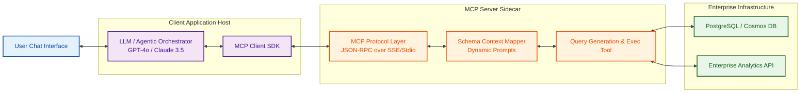

# Catchy LinkedIn Post: Conversational Database Interface using Model Context Protocol (MCP)

Here is a second technical LinkedIn post option, focusing on the **Model Context Protocol (MCP)**—a highly cutting-edge developer standard for connecting LLMs to external data sources.

---

### **LinkedIn Post Draft**

**Title:** Breaking the Sandbox: Connecting LLMs to Live Enterprise Databases with Model Context Protocol (MCP) 🔗

Most LLMs operate in a sandbox, blind to your real-time databases and business intelligence systems. The typical solution? Writing custom APIs, brittle middleware, or rigid text-to-SQL prompt templates.

But there’s a better way. Enter **Model Context Protocol (MCP)**—the new open standard that allows LLMs to securely and dynamically connect to external data sources and APIs.

We recently engineered an **Agentic Conversational Database Interface** that translates natural language queries into complex database operations (SQL/NoSQL) and returns verified insights. 

Here is how the architecture looks:

---

### **Why MCP is a Game Changer for Enterprise AI:**

1. **Decoupled Architecture:** The LLM client (the agentic brain) doesn't need to know the database credentials or schema details directly. It communicates with the MCP server using standard **JSON-RPC** protocol over SSE (Server-Sent Events) or Stdio.
2. **Schema-Context Mapping:** Instead of dumping an entire database schema into the LLM's context window (costly and confusing), the MCP Server dynamically maps relevant database schema schemas based on the user's intent.
3. **Safe Execution Layer:** Before running any generated query, the MCP Server parses, validates, and cleans the query string to prevent SQL injection, database locks, or destructive writes.

### **The Flow in Action:**
* **User asks:** "Show me the top 5 capital additions categorized in UK Pool 1 from last quarter."
* **LLM Client** recognizes the intent and calls the MCP tool `query_database` with generated schema parameters.
* **MCP Server** intercepts, compiles the proper SQL/Cosmos query, executes it safely, and returns the structured JSON dataset.
* **LLM Client** synthesizes the data and presents a clear, audit-ready answer.

No more building bespoke endpoints for every new question. Just pure, protocol-driven database interfacing.

---

💻 **For the developers out there:** Have you experimented with Model Context Protocol (MCP) yet? What’s your take on it compared to traditional Tool/Function Calling architectures?

Let's discuss! 👇

#ModelContextProtocol #MCP #GenerativeAI #SoftwareArchitecture #DatabaseDesign #Python #AgenticAI #WebDevelopment
